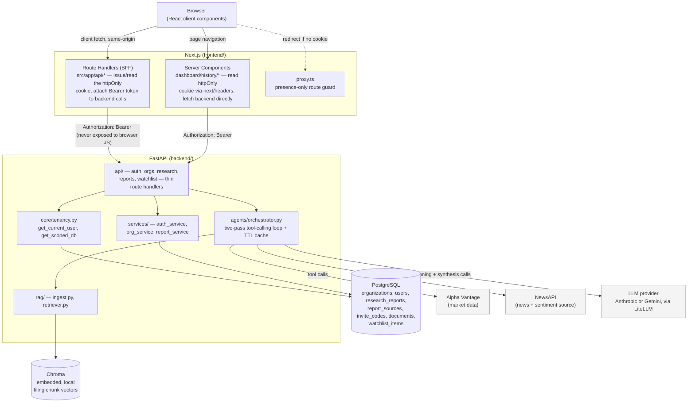
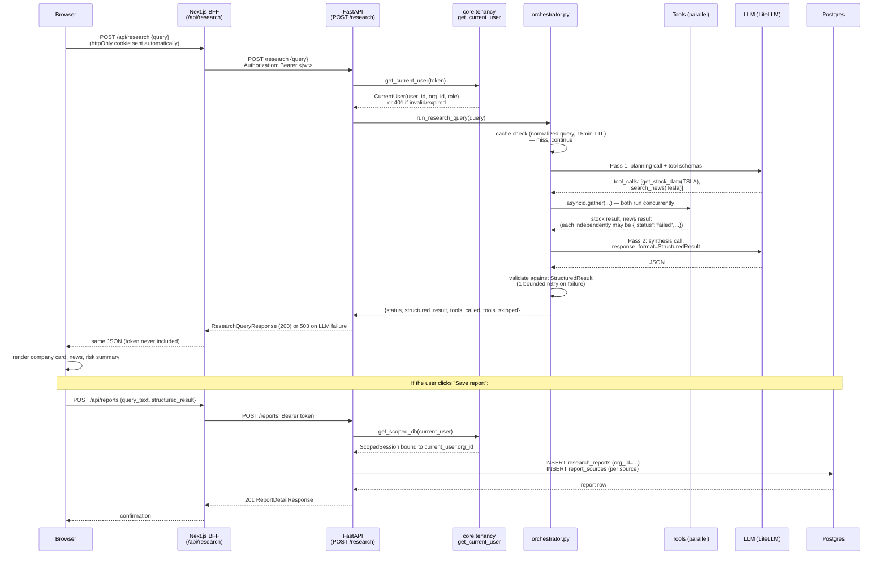
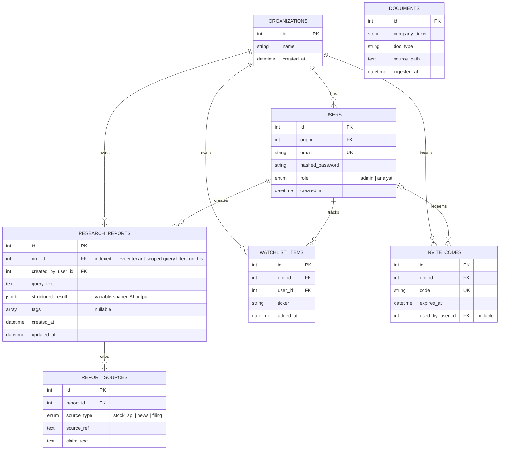
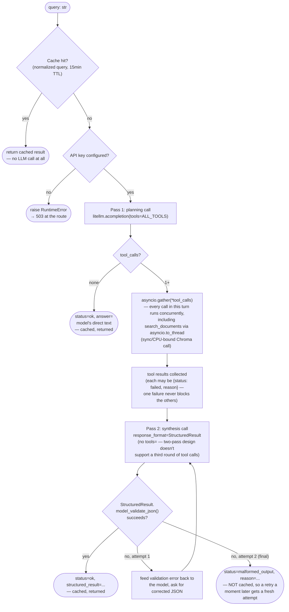
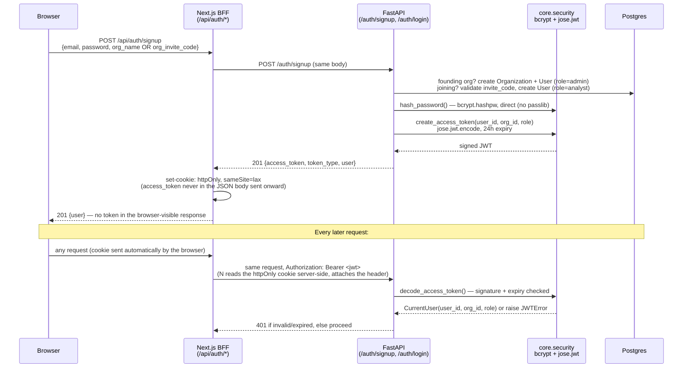
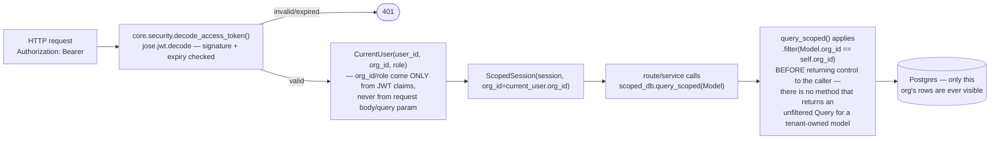

# Architecture

Klypup Investment Research Dashboard — Option A. This is the submission-ready
architecture document (PDF Section 4.2); `docs/TDD.md` is the original,
longer working design doc this was built from and goes deeper on the
reasoning behind each decision (also see [`DECISIONS.md`](DECISIONS.md)).

## 1. System Architecture

**Boundary that matters most:** the browser never calls the LLM, Alpha
Vantage, NewsAPI, or Chroma directly — only same-origin Next.js routes,
which either proxy to FastAPI (BFF pattern, for anything needing the
httpOnly-cookie token) or FastAPI itself does the external calls
server-side. API keys never reach client-side JS.

## 2. Data Flow — "Give me a quick overview of Tesla"

## 3. Database Schema (ER Diagram)

`documents` deliberately has no `org_id` — ingested filings are a shared
knowledge base across tenants, not tenant-owned data. Its actual chunk
vectors live in Chroma, not Postgres; this row is only ingestion metadata
letting a Chroma hit map back to a human-readable source.

`org_id` is indexed on every tenant-owned table specifically because
`ScopedSession.query_scoped()` (Section 6 below) filters on it on every
single query — an unindexed `org_id` would make that filter a sequential
scan under any real data volume.

## 4. AI Orchestration Flow

**Tool discrimination is prompt/schema design, not code logic.** The
planning call doesn't run a hardcoded sequence — each tool's JSON-schema
`description` is written specifically to help the model decide when *not*
to call it (e.g. `search_news`'s description explicitly says "do NOT use
this for stock price... use get_stock_data for that instead"). This is
what `agents/orchestrator.py`'s tool definitions demonstrate directly.

**Three tools, one concurrency mechanism.** `get_stock_data`
(Alpha Vantage) and `search_news` (NewsAPI) are real `async def` I/O.
`search_documents` (Chroma) is synchronous/CPU-bound — dispatched via
`asyncio.to_thread` so it participates in the same `asyncio.gather()` as
the other two without blocking the event loop for its duration.

## 5. Authentication & Authorization Flow

**Signup issues the JWT the same way whether founding a new org or joining
one** — the only branch is whether a new `Organization` row gets created
(role becomes `admin`) or an existing `invite_code` gets validated and
consumed (role becomes `analyst`). Either path, `org_id` in the resulting
token comes from a row the server just created or looked up — never from
anything the client typed in.

**Passwords:** hashed with `bcrypt.hashpw`/verified with `bcrypt.checkpw`
directly — not through `passlib`, whose last release (1.7.4) has a broken
bcrypt-handler self-test against `bcrypt>=4.1`. Calling bcrypt directly
avoids a dead dependency without hand-rolling any actual cryptography
(CLAUDE.md hard constraint: no hand-rolled crypto).

**The JWT itself** carries three claims — `sub` (user id), `org_id`,
`role` — and a 24-hour expiry. Every protected route depends on
`get_current_user` (`core/tenancy.py`), which decodes and validates the
token and returns a `CurrentUser`; nothing downstream re-parses a token or
re-derives identity any other way. `require_role(UserRole.ADMIN)` is the
same dependency with one more check on top, used to gate admin-only
routes like `POST /orgs/invite-codes` — an analyst hitting it gets a
`403` before the route body ever runs.

**Why the frontend stores the token in an httpOnly cookie, not
`localStorage`:** `localStorage` is readable by any JavaScript running on
the page — including a malicious script injected through an unrelated
bug elsewhere in the app. An `httpOnly` cookie is invisible to
client-side JS entirely; only a server can read or set it. Since only a
server context can set that kind of cookie, the Next.js Route Handlers
under `src/app/api/*` act as a thin backend-for-frontend: they call
FastAPI, receive the token in the JSON body, and re-issue it to the
browser as an httpOnly cookie — the actual token string is never in a
form client-side JavaScript could read, only ever passed server-to-server
after that point.

**Proven, not just asserted:** `tests/test_auth_service.py` covers
signup/login success and failure paths (duplicate email, wrong password,
expired/reused/invalid invite codes) directly against the service layer;
`tests/test_api_orgs.py` proves the RBAC boundary over real HTTP — an
analyst gets `403` on an admin-only route, the same admin account gets
`201` on the identical call.

## 6. Multi-Tenant Data Flow

**The specific anti-pattern this avoids:** a route or service function
manually writing `.filter(org_id=current_user.org_id)` per-query. That
pattern fails silently the moment exactly one call site forgets it, and
nothing catches that at review time — the query still *looks* correct.
`ScopedSession` makes the org filter structural: `query_scoped()` is the
*only* way to get a `Query` for a tenant-owned model through it, so a
route that wants to bypass scoping has to explicitly reach for a raw
`Session` (`get_db`) instead of `get_scoped_db` — a visible, reviewable
choice in a diff, not a silently-missing filter.

**Proven, not just asserted:** `tests/test_tenancy.py` constructs two orgs
and shows a session scoped to org A cannot see org B's rows even when
explicitly queried by primary key. `tests/test_api_reports.py`'s
cross-tenant test goes further — over real HTTP, with a real JWT: org B
gets **404, not 403**, on both `GET` and `DELETE` of org A's report
(`app/api/reports.py`), specifically so a 403 can't itself confirm to an
unauthorized caller that the report exists somewhere else. Then the same
report is shown still fully accessible/deletable by org A, proving the
404s were tenant-scoping and not a broken route.

## 7. API Design

Every route except `/auth/*` and `/health` requires `Authorization: Bearer
<jwt>`. `org_id` is resolved from the token server-side — never accepted
from a request body or query param, anywhere.

| Method | Path | Auth | Request | Response |
|---|---|---|---|---|
| `POST` | `/auth/signup` | none | `{email, password, org_name?, org_invite_code?}` | `201` `{access_token, token_type, user}` |
| `POST` | `/auth/login` | none | `{email, password}` | `200` `{access_token, token_type, user}` or `401` |
| `POST` | `/orgs/invite-codes` | Bearer, **Admin only** | — | `201` `{code, expires_at}` or `403` |
| `POST` | `/research` | Bearer | `{query}` | `200` `ResearchQueryResponse` (bimodal — see Section 4) or `503` on LLM failure |
| `POST` | `/reports` | Bearer | `{query_text, structured_result}` | `201` `ReportDetailResponse` |
| `GET` | `/reports` | Bearer | — | `200` `{reports: [{id, query_text, created_at}], total}` (org-scoped) |
| `GET` | `/reports/{id}` | Bearer | — | `200` full report or `404` (own-org-missing and cross-org both 404) |
| `DELETE` | `/reports/{id}` | Bearer | — | `204` or `404` |
| `POST` | `/watchlist` | Bearer | `{ticker}` | `201` `{id, ticker, added_at}` (dedupes per org) |
| `GET` | `/watchlist` | Bearer | — | `200` `{items: [...]}` (org-scoped) |
| `DELETE` | `/watchlist/{id}` | Bearer | — | `204` or `404` |
| `GET` | `/health` | none | — | `200` `{status, service}` — liveness only, no DB dependency |

Full request/response Pydantic schemas: `backend/app/schemas/`. Live
interactive docs at `http://localhost:8000/docs` (FastAPI's generated
OpenAPI UI) once the backend is running.
