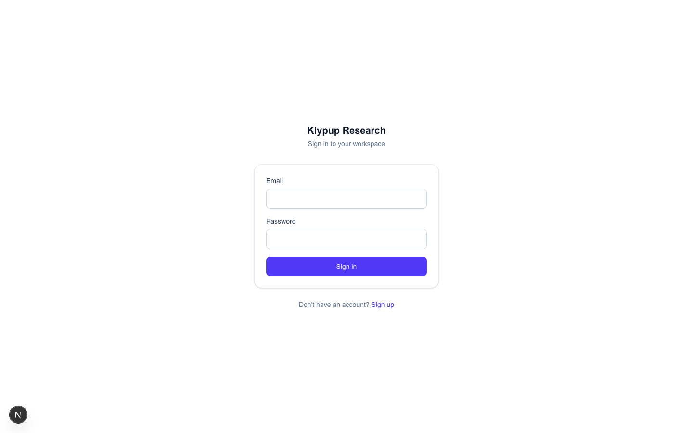
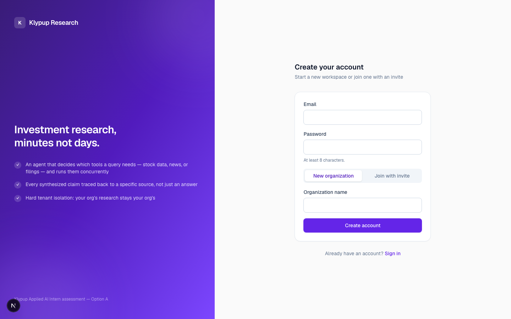
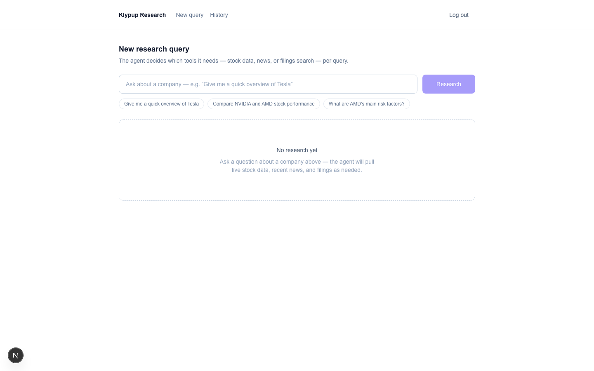
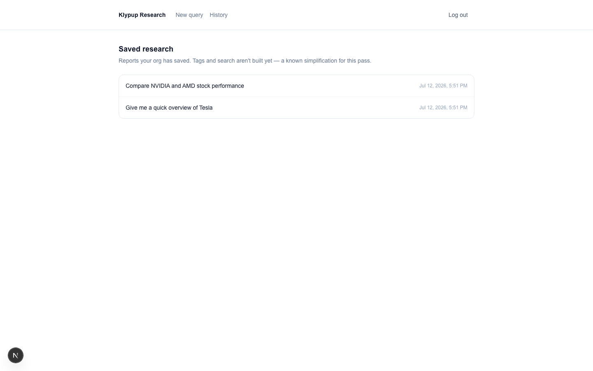
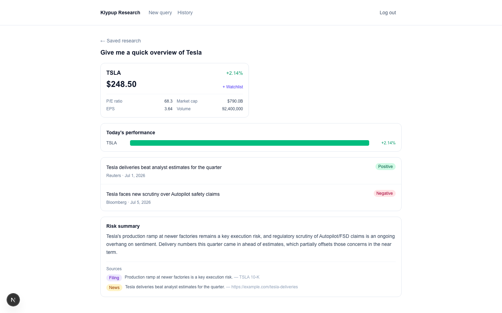
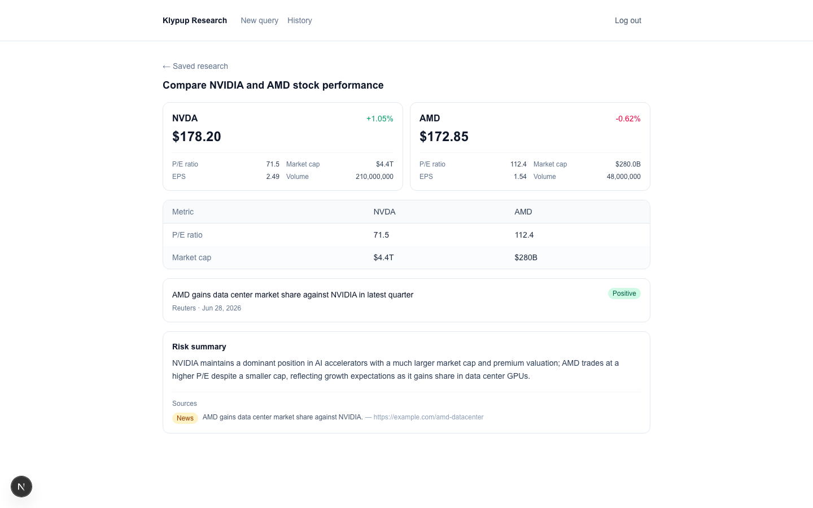
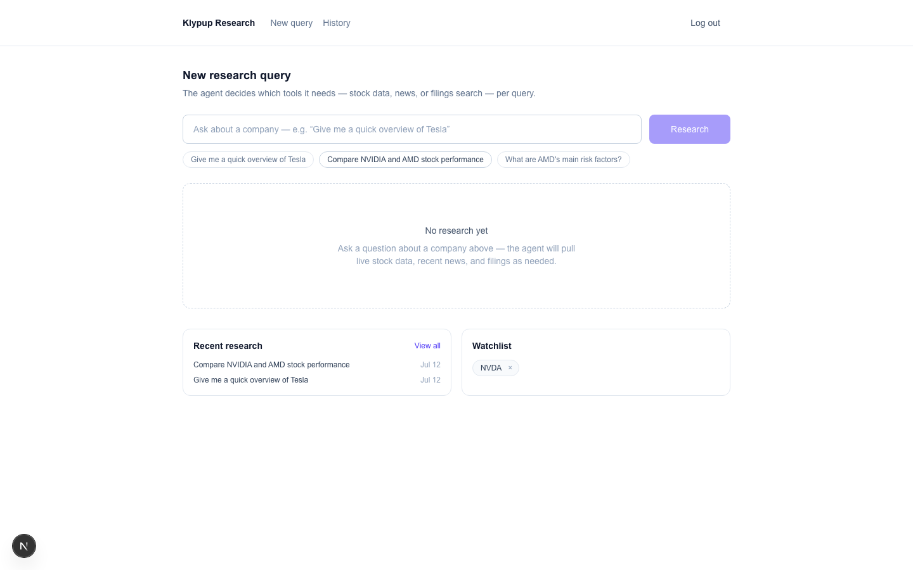

# Klypup Investment Research Dashboard

AI-orchestrated, source-attributed investment research — a user types a
natural-language query, an LLM-driven agent decides which of three tools
(stock data, news, SEC filing search) the query actually needs, runs them
concurrently, and synthesizes a structured, cited report. Multi-tenant,
JWT-authed, two roles (Admin/Analyst).

Built for the Klypup Applied AI Intern take-home assessment — **Option A:
Investment Research Dashboard**. See [`DECISIONS.md`](DECISIONS.md) for the
full "why" behind every major choice, and [`ARCHITECTURE.md`](ARCHITECTURE.md)
for diagrams (system architecture, data flow, ER diagram, AI orchestration
flow, multi-tenant flow, API design). `docs/PDD.md`/`docs/TDD.md` are the
original working design docs this was built from.

---

## Screenshots

| | |
|---|---|
|  Login |  Signup (create org / join by invite) |
|  Dashboard home — query box, recent research, watchlist |  Saved research history |
|  Saved report — company card, performance chart, sentiment news, risk summary w/ sources |  Saved report — multi-company comparison table + chart |
|  Dashboard home after adding a company to the watchlist | |

---

## Tech stack

| Layer | Choice | Why (brief — full rationale in DECISIONS.md) |
|---|---|---|
| Frontend | Next.js 16 (App Router) + TypeScript + Tailwind | Server Components for auth-gated data fetching without a client-exposed API layer |
| Backend | FastAPI (Python) | Thin routes / services / models separation, native Pydantic validation |
| Database | PostgreSQL (SQLAlchemy, Alembic) | Relational metadata + JSONB for the variable-shaped structured result |
| Vector store | Chroma (embedded, local) | Explicit, argued choice over pgvector/Pinecone — see TDD Section 8 |
| LLM orchestration | Hand-rolled tool-calling loop via LiteLLM | No agent framework — every step of the loop is code you can point to and explain; LiteLLM only normalizes the provider request/response shape (Anthropic/Gemini/etc.), it doesn't run the loop |
| Auth | JWT (`python-jose`) + `bcrypt` directly | Stateless, carries `org_id`/`role` as claims for structural tenant scoping |

## Required data integrations

1. **Market data** — Alpha Vantage (real-time price, change %, P/E, market cap, EPS, volume)
2. **News + sentiment** — NewsAPI, with positive/negative/neutral classification
3. **Document knowledge base** — Chroma, ingesting sample 10-K excerpts for AMD/NVDA/TSLA, chunked (~500 tokens, ~50 overlap) and embedded, with a similarity-threshold confidence gate (a below-threshold match is reported as "no strong match," never silently fed to synthesis as if reliable)
4. **API interface** — every AI/data feature is a REST endpoint; the frontend never calls the LLM or an external API directly

---

## Prerequisites

- Python 3.11–3.13 (LiteLLM currently caps at `<3.14`)
- [Poetry](https://python-poetry.org/docs/#installation)
- Node.js 22.13+ (pnpm 11.x's minimum supported version) and [pnpm](https://pnpm.io/installation) (`corepack enable` if you don't have pnpm yet)
- Docker (for Postgres)
- API keys, all free-tier:
  - [Alpha Vantage](https://www.alphavantage.co/support/#api-key) (market data — instant)
  - [NewsAPI](https://newsapi.org/register) (news)
  - **One** LLM provider: [Anthropic](https://console.anthropic.com/) **or** [Google AI Studio](https://aistudio.google.com/apikey) (Gemini)

## Setup

### 1. Database

```bash
docker compose up -d
```

### 2. Backend

```bash
cd backend
cp .env.example .env        # fill in your real keys + a random JWT_SECRET_KEY
poetry install
poetry run uvicorn app.main:app --reload --port 8000
```

Verify: `curl http://localhost:8000/health` → `{"status": "ok", ...}`

### 3. Seed data (so there's something to see immediately)

```bash
# still in backend/, same terminal or a new one with the venv active
poetry run python scripts/run_ingestion.py    # chunks + embeds the sample filings into Chroma
poetry run python scripts/seed_demo_data.py   # creates 2 demo orgs, users, and 2 saved reports
```

The seed script prints exactly what it created. It's idempotent — safe to
re-run. Demo logins (all use password `demo-password-123`):

| Email | Org | Role |
|---|---|---|
| `admin@acmecapital.demo` | Acme Capital | Admin (has 2 saved reports) |
| `analyst@acmecapital.demo` | Acme Capital | Analyst |
| `admin@betainvestments.demo` | Beta Investments | Admin (separate org — sees none of Acme's data) |

### 4. Frontend

```bash
cd frontend
cp .env.example .env.local
pnpm install
pnpm dev
```

Visit `http://localhost:3000` → log in with a demo account above.

---

## Testing

```bash
cd backend
poetry run pytest        # 55 tests: services, tenancy/cross-org isolation, orchestrator, RAG, API routes
poetry run ruff check .
```

```bash
cd frontend
pnpm lint
npx tsc --noEmit
pnpm build
```

All of the above also run in CI (`.github/workflows/ci.yml`) on every push to
`main` and every pull request — backend against a real Postgres service
container running the same Alembic migration this README's setup steps
use, frontend as its own parallel job.

## Project structure

```
klypup/
├── backend/
│   ├── app/
│   │   ├── api/         # thin route handlers (auth, orgs, research, reports)
│   │   ├── core/         # config, JWT/password hashing, tenant-scoping dependency
│   │   ├── agents/       # the tool-calling orchestrator + tool implementations
│   │   ├── rag/           # Chroma ingestion + confidence-gated retrieval
│   │   ├── models/         # SQLAlchemy models
│   │   ├── schemas/        # Pydantic request/response contracts
│   │   └── services/        # business logic between routes and models
│   ├── scripts/          # manual verification + seed scripts (not pytest)
│   ├── data/filings/      # sample 10-K excerpts used by the RAG pipeline
│   └── tests/
├── frontend/
│   └── src/
│       ├── app/            # Next.js App Router pages + BFF route handlers (src/app/api/)
│       ├── components/      # UI, split by domain (auth/, dashboard/, research/, ui/)
│       └── lib/              # shared types (mirroring backend Pydantic schemas), helpers
├── docs/
│   ├── PDD.md, TDD.md      # original working design docs
│   └── screenshots/         # for this README
├── ARCHITECTURE.md
├── DECISIONS.md
└── docker-compose.yml       # Postgres only — backend/frontend run natively for faster iteration
```

## Known limitations

- **No tag/search filtering** on saved research history yet — a deliberate scope call for this pass, noted inline in the UI itself.
- **Performance chart is today's % move, not a historical time series** — a deliberate choice: a real multi-day line chart would need a third Alpha Vantage call per ticker on top of an already rate-limited free tier, for a demo-scale improvement in a place that already renders real data (`change_percent`) honestly.
- **`docker-compose.yml` covers Postgres only** — backend/frontend run natively (`poetry run uvicorn` / `pnpm dev`) for faster hot-reload during development; full containerization is a natural next step, not a required one for local setup.
- **In-process cache, not Redis** — query results cache for 15 minutes in a plain dict (actively evicted, not just lazy) in the single backend process. A documented, argued trade-off for a single-instance deployment — see DECISIONS.md and TDD Section 12.
- **No live deployment** — runs locally only; see DECISIONS.md for what a deploy would take.
- **LLM provider free-tier quotas** — whichever provider you configure has its own daily/per-minute request caps; the app surfaces a provider outage or quota limit as a clean "AI service temporarily unavailable" 503 rather than crashing, per the graceful-degradation requirement.
- **No export (PDF/CSV)** — explicitly out of scope for this pass, in favor of the core agent/RAG/multi-tenant requirements.
